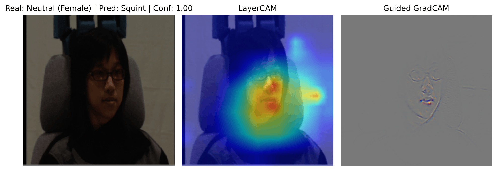
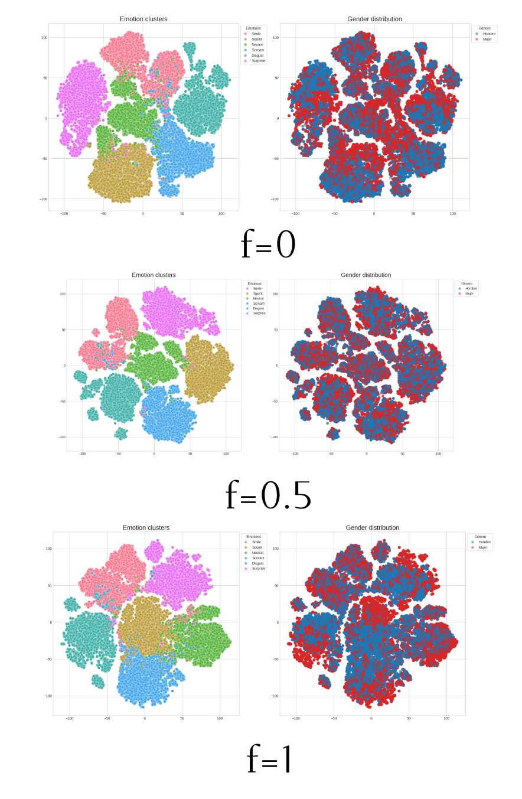
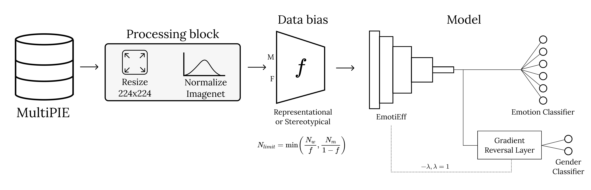
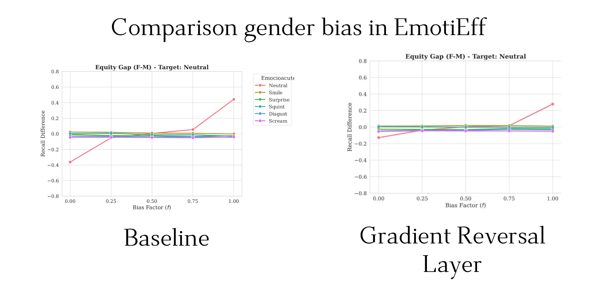

# Facial Expression Fairness: Auditoría y Mitigación de Sesgos en FER


> **Trabajo de Fin de Máster (TFM)** - Máster en Inteligencia Artificial, Universidad Politécnica de Madrid (UPM).  
> **Autor:** Mario Gutiérrez López

### 1. El problema: Atajos Estadísticos y Sesgo Estereotípico
En entornos desbalanceados, las CNNs ignoran la morfología facial y explotan atributos demográficos. En este ejemplo, los mapas de activación (LayerCAM/Guided Grad-CAM) demuestran cómo el modelo clasifica erróneamente una emoción fijándose exclusivamente en la barba del sujeto o en el fondo de la habitación.

<!--  -->

<br>
*> Figura 1: Análisis de interpretabilidad donde la red ignora los rasgos perioculares y utiliza atajos espurios.*

Además en este entrenamiento donde el modelo solo ha visto hombres (f=0) y mujeres (f=1) muestran un desorden en el espacio latente agrupando las imágenes en clústeres según el género en vez de la expresión a clasificar en MultiPIE. En el medio se muestra un entrenamiento con el género balanceado (f=0.5)


<br>
*> Figura 2: Análisis del espacio latente mediante t-sne.*


### 2. La Solución: Arquitectura Adversarial (Gradient Reversal Layer)
Para mitigar la absorción de sesgos de bases de datos *in-the-wild* (AffectNet, Aff-Wild2) y preentrenamientos (VGGFace2), se ha implementado una capa GRL. Esta bifurcación penaliza la predicción del género durante la retropropagación, forzando a la red a generar representaciones agnósticas a la demografía.


<!--  -->

<br>
*> Figura 3: Pipeline de la arquitectura basada en EmotiEff con adaptación de dominio adversarial.*

### 3. El Resultado: Reducción del sesgo de género
A través de la capa Gradient Reversal Layer se ha conseguido reducir el aprendizaje de atajos espurios de género para clasificar las emociones logrando una mayor recall incluso en fotos de géneros que no ha visto durante el entrenamiento.

<!--  -->

<br>
*> Figura 4: Comparación modelo base con GRL en EmotiEff*

## Tabla de Contenidos
- [Descripción del Proyecto](#descripción-del-proyecto)
- [Hitos del Desarrollo Experimental](#hitos-del-desarrollo-experimental)
- [Memoria del Proyecto](#memoria-del-proyecto)
- [Instalación](#instalación)
- [Manual de Uso y Ejecución](#manual-de-uso-y-ejecución)

---

## Descripción del Proyecto
Este repositorio contiene el código fuente para la auditoría y mitigación de sesgos demográficos e iluminativos en sistemas de Reconocimiento de Expresiones Faciales (FER - *Facial Expression Recognition*). 

El objetivo principal es analizar cómo factores exógenos e *in-the-wild* (como el *Face Skin Brightness*, la pose de la cámara o el género) afectan a la distribución del espacio latente en redes neuronales profundas, proponiendo soluciones geométricas y arquitecturas de mitigación adversarial.

---

## Hitos del Desarrollo Experimental
El proyecto se ha estructurado metodológicamente en 5 fases incrementales para aislar y auditar las diferentes variables de confusión:

1. **Hito 1: Pipeline base en MultiPIE:** Establecimiento de la infraestructura técnica (ResNet50) y flujos de preprocesamiento en un entorno de laboratorio controlado para servir como línea base.
2. **Hito 2: Sesgo de género en entorno controlado:** Auditoría cuantitativa orientada a aislar los efectos del sesgo representacional y estereotípico asociados exclusivamente al atributo de género.
3. **Hito 3: Análisis latente e iluminación *in-the-wild*:** Salto a entornos reales (AffectNet y Aff-Wild2) para estudiar la vulnerabilidad estructural ante perturbaciones lumínicas usando la métrica FSB (*Face Skin Brightness*).
4. **Hito 4: Arquitectura *EmotiEff* y mitigación adversaria:** Evolución hacia el estado del arte (SOTA) implementando una *Gradient Reversal Layer* (GRL) para penalizar y eliminar la información demográfica del espacio latente.
5. **Hito 5: Auditoría de control estricto:** Experimentos definitivos con aislamiento multifactorial (género, emoción, pose e iluminación balanceados) entrenando desde cero (*from scratch*) para eliminar sesgos intrínsecos de ImageNet.

---

## Memoria del Proyecto
El documento completo de la tesis se encuentra disponible para su consulta. 
**[Puedes consultar el borrador en vivo aquí](https://es.overleaf.com/read/grfqztcmdkdf#494df4)**

---

## Instalación
Clona el repositorio e instala las dependencias. Se recomienda encarecidamente utilizar un entorno virtual (Conda o venv):

```bash
git clone https://github.com/mariogutierrezlopez/facial-expression-fairness.git
cd facial-expression-fairness

# Crear entorno e instalar dependencias
pip install -r requirements.txt
```

---

## Manual de Uso y Ejecución
Todo el flujo de entrenamiento, validación y extracción de métricas está centralizado en el script `main.py`. Este archivo gestiona la ejecución de experimentos dependiendo de los argumentos proporcionados.

### 1. Entrenamiento Base (Selección de Dataset)
Para lanzar un entrenamiento desde cero, utiliza el flag `--dataset` indicando la base de datos objetivo (`multipie`, `affectnet` o `affwild2`):

```bash
python src/main.py --dataset affectnet
```

### 2. Evaluación y Extracción de Embeddings (Test Only)
Si deseas saltar la fase de entrenamiento y utilizar un modelo previamente entrenado para extraer métricas o vectores latentes, combina los flags `--test_only` y `--ckpt_path`:

```bash
python src/main.py --dataset affectnet --test_only --ckpt_path checkpoints/mi_modelo/last.ckpt
```

### 3. Ejecución de Arquitectura SOTA (EmotiEff)
Para los experimentos correspondientes a los Hitos 4 y 5, puedes activar la arquitectura avanzada *EmotiEff* utilizando el flag `--sota`:

```bash
python src/main.py --dataset multipie --sota
```

### 4. Experimentos de Iluminación (Hito 3)
Para auditar la robustez del modelo ante variaciones lumínicas en bases de datos *in-the-wild*, utiliza el flag `--brightness` para aplicar las perturbaciones controladas:

```bash
python src/main.py --dataset affectnet --test_only --brightness 1.25 --ckpt_path checkpoints/mi_modelo/last.ckpt
```

### 5. Paralelización de Experimentos (Grid/Slurm)
El script está preparado para dividir la carga de trabajo de múltiples experimentos (muy útil si se ejecuta en un clúster de GPUs o mediante *Slurm*). Puedes usar `--split_idx` y `--num_splits` para que una terminal ejecute solo una fracción de la cola de experimentos:

```bash
# Terminal 1 ejecuta la primera mitad de los experimentos
python src/main.py --dataset multipie --num_splits 2 --split_idx 0

# Terminal 2 ejecuta la segunda mitad
python src/main.py --dataset multipie --num_splits 2 --split_idx 1
```